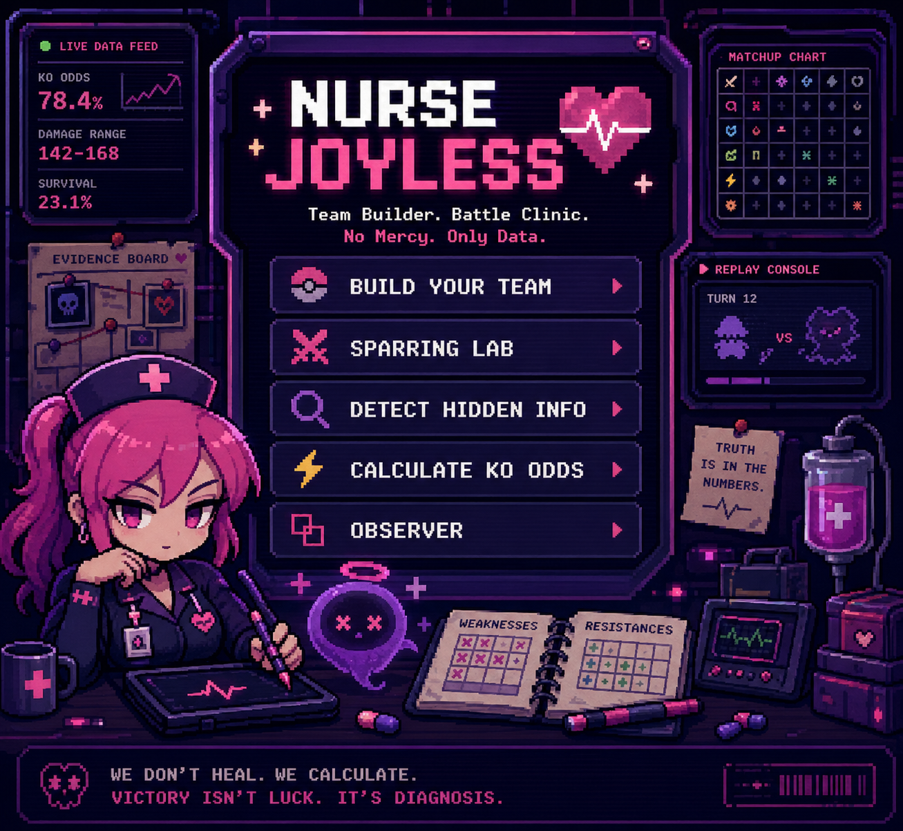

# Nurse Joyless

<p align="center">
  
  
  
  
</p>

<p align="center">
  <strong>A competitive Pokémon Showdown team clinic.</strong><br>
  Nurse Joy heals Pokémon. Nurse Joyless heals bad decisions.
</p>

<p align="center">
  
</p>

Paste a Showdown team, and Nurse Joyless turns it into a structured strategic report: what the team is trying to be, where the structure breaks, how it performs into common archetypes, which slots are overloaded, what the reliable win paths are — and exactly which Pokémon could patch the problem while preserving your favorites.

## What it does

| Surface | What you get |
|---|---|
| **Team Clinic** | Parsed roster cards with sprites, items, types, and set details |
| **Diagnosis** | Type-liability chart (weak / 4× / resist / immune), missing roles, redundancy, issue score, offensive coverage gaps |
| **KO Lab** | Damage range, KO hits, hit chance, KO odds — with screens, stages, weather, terrain, Tera, hazards, status, spread moves, and priority-blocker detection. Plus a full team-vs-team **survival matrix** |
| **Detective** | Hidden-information reads: what an opponent's item, ability, or spread must (and must not) be given what you've observed |
| **Prescription** | Keep your emotional core; rebuild the rest from targeted suggestions |
| **Replay Observer** | Paste a Showdown battle log → turn-by-turn evidence, item/ability reveals, priority-block and move-immunity deductions |
| **Sparring Lab** | Matchup matrix vs. common archetypes, biggest needs, and a **speed-tier table** vs. meta benchmarks |
| **Team Identity** | Archetype detection — weather squads, Trick Room, Tailwind, Screens, Webs, Stall, Balance, Hyper Offense, Dragon Spam — scored on multiple signals, not one move |
| **Synergy Checker** | Seven-axis structural scoring: type synergy, role compression, offensive coverage, defensive backbone, field control, speed control, win reliability |
| **Assistant** | Lane-diverse addition suggestions with sets, reasoning, and one-click apply/replace — optionally enriched with live Smogon OU data |
| **Move Validation** | Learnset/ability/EV legality with confidence levels — confirmed illegal flagged, uncertain surfaced as warnings |
| **Exports** | Markdown scouting report, JSON report, team text — and **shareable team links** (`#team=…`) |

## Stack

- **React 19 + Vite + strict TypeScript** in [`web/`](web/)
- **DOM-free engine** in [`web/src/engine/`](web/src/engine/) — every module is pure functions, so it runs in tests, workers, or a future backend
- **`@pkmn/dex`** — the full Gen 9 Pokédex (every species, move, ability, learnset) with curated local overrides
- **`@smogon/calc`-informed KO math** with hazard chip, Tera, screens, stages, spread moves, and defensive abilities
- **Vitest** — the behavioral spec ported from the legacy harnesses
- **GitHub Pages** static deploy; optional Cloudflare Worker for Ollama-powered agent chat

The v4 engine replaces a 2,400-line monolith plus 23 ordered monkey-patch files with typed modules — same reasoning depth, none of the load-order fragility. Module map and migration notes: [docs/ARCHITECTURE.md](docs/ARCHITECTURE.md).

## Run it

```bash
cd web
npm ci
npm run dev        # http://localhost:5173
```

```bash
npm run build      # production bundle in web/dist
npx vitest run     # engine reasoning suite
./node_modules/.bin/tsc -b   # typecheck
```

From the repo root: `npm run dev:web`, `npm run build:web`, `npm run test:web`. The legacy v3 app (`index.html` + `src/*.js`) remains frozen while its behavioral spec is fully ported; `npm test` still runs the legacy suite.

## Try it

1. Paste a team import (or **Load demo patient**).
2. **Analyze patient** → identity card, diagnosis, validation.
3. **KO Lab** → pick attacker/defender, tune the field, read the KO odds — then scan the survival matrix.
4. **Replay Observer** → drop a battle log, watch the evidence timeline.
5. **Suggest Additions** → pick a lane, apply or swap a set in one click.
6. **Copy share link** → send the team to a friend; the roster loads straight from the URL.

## License & credit

Fan-made project. Not affiliated with Nintendo, Game Freak, Creatures Inc., The Pokémon Company, or Pokémon Showdown. Battle data via [`@pkmn/dex`](https://github.com/pkmn/ps); set data via [data.pkmn.cc](https://data.pkmn.cc). Inspired by Foul Play concepts; no Foul Play code used.
